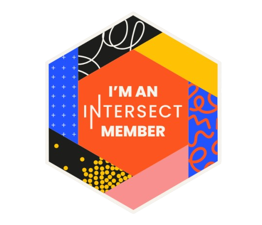
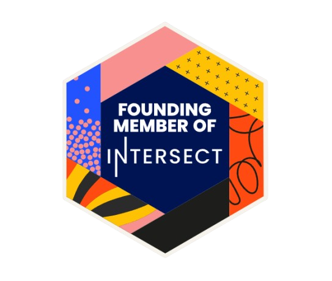
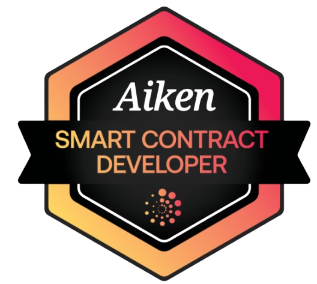

<p align="center">
  
  
  
</p>


---

###  Languages I Use the Most

<p>
  
  
  
  
  
  
  
</p>

---

###  Dev_Stack

```mermaid
mindmap
  root((🛠 Tech Stack))
    Cardano
      CLI
      Node/Testnet
      Explorer
    Languages
      Haskell
      Aiken
      Plutus
      JavaScript
      C++
    Frameworks
      React
      Next.js
      Lucid
      n8n
    Infra
      Docker
      Netlify
      GitHub Actions
      Firebase
    Governance
      DRep
      Milestone Reviewer
